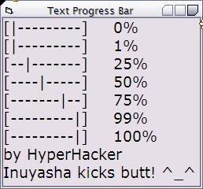

<div align="center">

## Text Progress Bar


</div>

### Description

Give this function a number from 0 to 100, and it will generate a cool progress bar made of text!
 
### More Info
 
A number from 0 to 100. (Using a bigger value will cause the bar to extend.)

A string containing a progress bar made of text.


<span>             |<span>
---                |---
**Submitted On**   |
**By**             |[HyperHacker](https://github.com/Planet-Source-Code/PSCIndex/blob/master/ByAuthor/hyperhacker.md)
**Level**          |Beginner
**User Rating**    |4.3 (34 globes from 8 users)
**Compatibility**  |VB 3\.0, VB 4\.0 \(16\-bit\), VB 4\.0 \(32\-bit\), VB 5\.0, VB 6\.0, VB Script, ASP \(Active Server Pages\) , VBA MS Access, VBA MS Excel
**Category**       |[String Manipulation](https://github.com/Planet-Source-Code/PSCIndex/blob/master/ByCategory/string-manipulation__1-5.md)
**World**          |[Visual Basic](https://github.com/Planet-Source-Code/PSCIndex/blob/master/ByWorld/visual-basic.md)
**Archive File**   |[](https://github.com/Planet-Source-Code/hyperhacker-text-progress-bar__1-57206/archive/master.zip)


### Source Code

```
Function MakePercentBar(ByVal Value As Long) As String
Dim i As Long
MakePercentBar = "["
For i = 1 To ((Value - 1) \ 10)
  MakePercentBar = MakePercentBar + "-"
Next i
MakePercentBar = MakePercentBar + "|"
For i = 10 To ((Value - 1) \ 10) + 2 Step -1
  MakePercentBar = MakePercentBar + "-"
Next i
MakePercentBar = MakePercentBar + "]"
End Function
```

